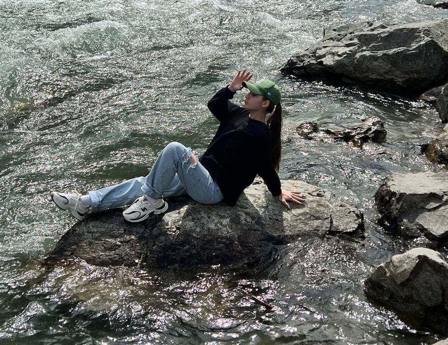

    
  
<h1>Уже несколько лет занимаюсь маникюром и имею постоянных клиентов.</h1>
    
Мой опыт и профессионализм подтверждаются отзывами и фотографиями работ, которые представлены в разделе "Ноготочки клиентов".

</section>
<section>
    <h2>Совместно мы выбираем оптимальный</h2>

    

        
        
дизайн

    

    

        
        
цвета

    

    

        
        
декоративные элементы

    

    <h2 align = "right">чтобы создать уникальный и гармоничный образ.</h2>
</section>
    <frame src="y.html">
<footer align = "center">
@2024, Армавир
</footer>
</body>
</html>
